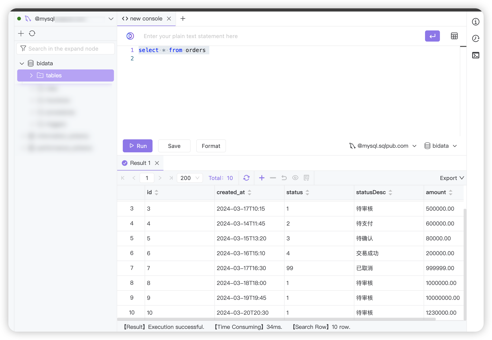
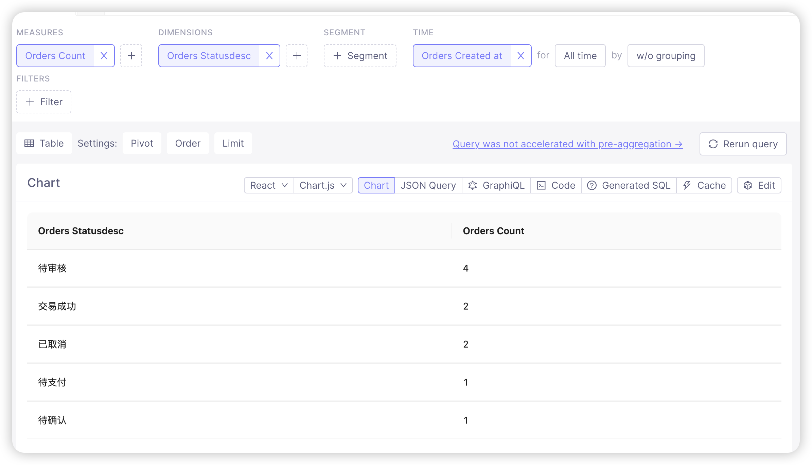
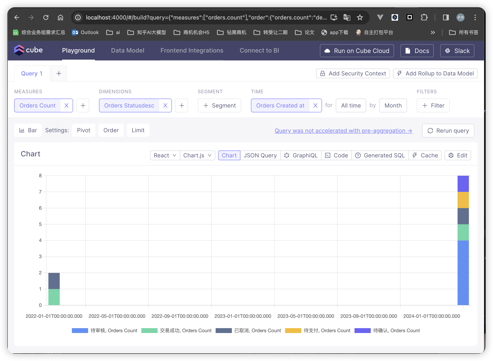
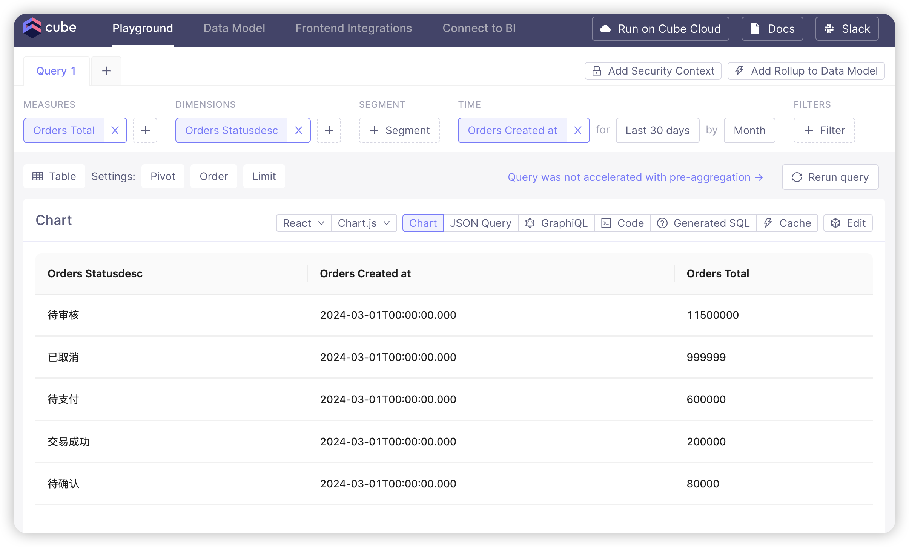
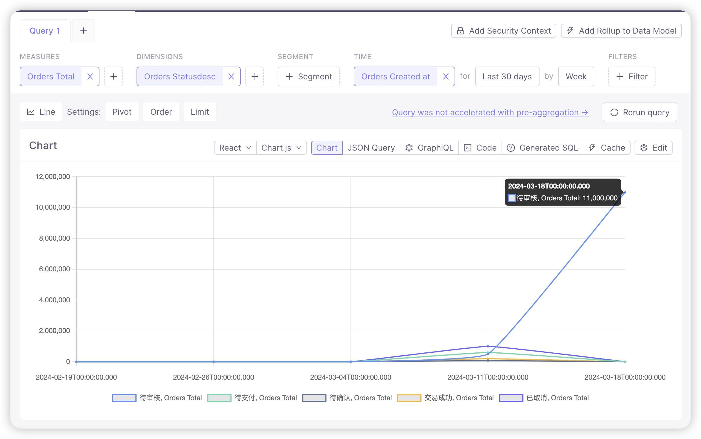

Hello my bi project

count 统计

金额 计总

install

mkdir my-bi-project
cd my-bi-project

npm install -g cubejs-cli
cubejs create my-cubejs-project -d <your-database>

require
1. docker
2. mysql / other db

配置数据库
创建.env文件

CUBEJS_DB_TYPE=<your-database>
CUBEJS_DB_HOST=<your-db-host>
CUBEJS_DB_NAME=<your-db-name>
CUBEJS_DB_USER=<your-db-user>
CUBEJS_DB_PASS=<your-db-password>

运行
docker-compose up -d --build

停止
docker-compose down

description

Cube.js 是一个开源的分析平台，专为开发人员设计，用于构建数据分析应用程序。它提供了一个强大的数据建模层，可以让你定义数据模型、度量和维度，同时提供了灵活的查询API，让前端应用可以轻松地请求这些数据。Cube.js 可以与任何SQL数据库如 PostgreSQL、MySQL、SQLite 以及一些大数据解决方案如 Apache Druid 和 ClickHouse 集成。

Cube.js 的主要用途和特点包括：
构建数据分析应用：Cube.js 被设计为服务端和客户端的数据分析层，支持构建复杂的数据分析和可视化应用，如仪表盘、报表和数据探索工具。

数据建模：开发人员可以使用 Cube.js 定义数据模型，包括度量、维度、过滤器和分段，这有助于组织和简化对数据的查询。

高性能查询：Cube.js 通过预聚合、智能查询缓存和分布式查询引擎来优化查询性能，特别适用于处理大数据集。

灵活的数据源集成：Cube.js 可以连接到几乎所有的 SQL 数据库，同时支持多种数据库，让你可以在同一个应用中同时使用不同的数据源。

前端集成：提供了与 React、Vue 和 Angular 等前端框架集成的客户端库，使得开发富交互性的数据分析前端变得更加简单。

开发者友好：提供了丰富的开发工具和资源，如 CLI 工具、开发者播放列表和社区支持，帮助开发人员快速上手和解决问题。

可扩展性和安全性：Cube.js 设计用于构建可扩展的数据分析应用，支持多租户架构和细粒度的访问控制，确保数据的安全性。

使用场景
Cube.js 被广泛用于构建需要复杂数据处理和分析功能的企业级应用，如：

商业智能（BI）工具和仪表盘
客户数据平台（CDP）
实时数据监控和报警系统
数据探索和报告工具